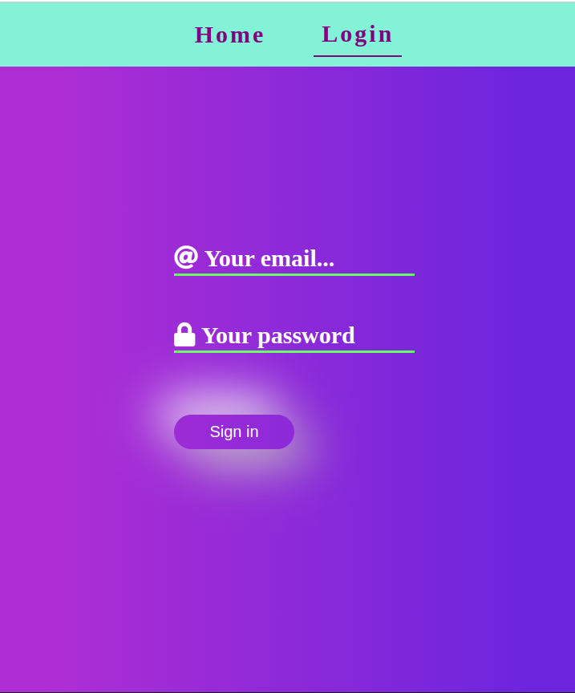

# Flash_Cards
## Tools

- Frontend : HTML, Sass, JS, DOM

- Tools : Github, VSCode, Github, Netlify 

## Meine Projekten

- Flash Card
- Login
- LocalStorage

## Color und Bild wahlen

- BacgroundColors   : "#B5FFD9", "#84F2D6"
- Text Colors       : "#FFFFFF", "#B5FFD9", "#800080", "#00000"

## Links

- You can visit Memory Cards App click [here](https://flashcard-project.netlify.app/) 

 
